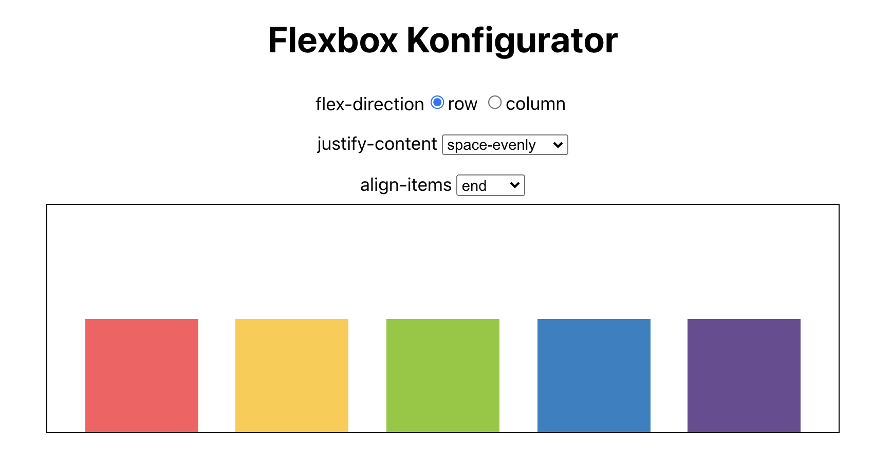

# Flexbox-Generator

- Erstelle einen interaktiven Flexbox-Generator, mit dem man die folgenden Flexbox-Einstellungen über Formular-Elemente setzen kann:

  - `flex-direction` (Radio-Buttons)
  - `align-items` (Dropdown)
  - `justifyContent` (Dropdown)

- Der Generator sollte folgende Komponenten besitzen:

  - Eine Radio-Group zur Auswahl der `flex-direction`
  - Jeweils ein `select` Element zur Auswahl von `justify-content` und `align-items`
  - Einen Eltern-Container, der 5 bunte Kind-Elemente hat, die die gesetzten Flex-Einstellungen direkt übernehmen

- Verwende State-Variablen, um die gesetzten Eigenschaften zu speichern und direkt die Auswirkungen auf die Styles der Kind-Elemente anzeigen zu können.

---